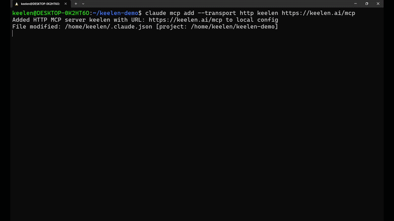

# keelen-mcp

**Onboard an autonomous dev team from your chat window: in one sentence.**



Paste [SETUP.md](SETUP.md) into Claude (or any MCP-capable agent) and say
**"set me up."** Your agent creates the account, connects your GitHub repo,
and submits the first build request. From then on, a bounded PM → dev →
verify loop turns plain-English requests into **tested, merged pull
requests**, and you steer all of it from chat.

No dashboard required to drive it. No tokens resold: the loop runs on
**your own** [Claude, Codex, GLM, or Kimi
key](https://keelen.ai/?utm_source=mcp-repo&utm_medium=referral&utm_campaign=readme).
Every change passes your tests and CI before it can merge.

This repo is documentation only. It describes the hosted [Model Context
Protocol](https://modelcontextprotocol.io) (MCP) server at
`https://keelen.ai/mcp` and how to drive the entire signup → connect →
ship flow without ever leaving your agent.

## What Keelen does

Keelen is **loop engineering as a managed service.** You describe what you want
built and steer from chat; a bounded, continuous PM → dev → QA loop does the
rest. Against your GitHub repo it turns your requests into roadmap items and
tasks, writes the code, opens pull requests, runs your tests, and reports
back — all while you keep steering from a chat window (yours, or your agent's).

Every change is **verified before it lands.** Keelen gates each pull request on
*your* test suite and CI — not the agent's own opinion of its work — and holds
anything that fails for automatic rework instead of merging it.

## Set up in 60 seconds

**Claude Code** — connect the server tokenless, then hand your agent the
setup script:

```
claude mcp add --transport http keelen https://keelen.ai/mcp
```

Then paste the contents of [`SETUP.md`](SETUP.md) into your agent and say
**"set me up"**. It will ask for your email, ask for the 6-digit code that
lands in your inbox, and take it from there — engine connect, GitHub
connect, first project, and provisioning, end to end.

Using a different client? See the per-client guides:

- [Claude Code](clients/claude-code.md)
- [Claude Desktop](clients/claude-desktop.md)
- [Codex](clients/codex.md)
- [Cursor](clients/cursor.md)
- [Windsurf](clients/windsurf.md)
- [Generic / other MCP clients](clients/generic.md)

Building a Roblox game? Keelen can generate art, audio, meshes, skyboxes, and
animated characters from plain-language requests — see
[`roblox-assets.md`](roblox-assets.md).

## Tools (abbreviated)

The server exposes 29 tools. Two work with no key at all (`signup`,
`verify_email`); the rest need the bearer key `verify_email` gives you. Full
reference with parameters and behavior: [`TOOLS.md`](TOOLS.md).

| Group | Tools |
| --- | --- |
| Getting started | `signup`, `verify_email` |
| Onboarding | `get_onboarding_status`, `open_dashboard`, `connect_github`, `list_github_repos`, `import_project`, `get_provisioning_status`, `get_billing` |
| Projects & roadmap | `list_projects`, `create_project`, `archive_project`, `delete_project`, `submit_request`, `get_request_status`, `answer_request`, `refine_request`, `set_product_vision`, `set_product_goal`, `list_roadmap`, `reorder_roadmap`, `cancel_roadmap_item`, `clear_horizon_pin`, `project_status`, `list_escalations`, `resolve_escalation`, `control_scheduler` |
| Other | `run_security_review`, `rollback_roblox_place` |

The server speaks MCP protocol revision `2026-07-28` as well as the earlier
handshake revisions, from the same endpoint — no client action is required
either way. Details in [`clients/generic.md`](clients/generic.md#protocol-support);
notable contract changes are recorded in [`CHANGELOG.md`](CHANGELOG.md).

## FAQ

**Is my code touched before I agree to anything?** No. Connecting the MCP
server tokenless only lets you sign up and verify your email — it can't see,
read, or modify any repository. `connect_github` requires an explicit
GitHub App install you approve in your browser, and every following build
runs inside an isolated per-tenant sandbox scoped to your own workspace.

**What does it cost?** Signing up, connecting GitHub, and creating a project
are all free. Actually running the autonomous loop (compute) requires an
active subscription — `get_billing()` returns a Stripe checkout link the
moment you're ready. A free/unpaid workspace can do everything up through
project creation and provisioning; iterations start once billing is active.

**How do I revoke access?** Every key minted through this flow (or the
dashboard) can be individually revoked. Go to your Keelen dashboard →
**Settings → API keys** and delete the key. Revoking takes effect
immediately; your agent will need a fresh key (rerun the signup flow, or
mint a new one from the dashboard) to keep calling the server.

See [`SECURITY.md`](SECURITY.md) for the full security model: what the MCP
server can and can't reach, rate limits, and key handling.

## Support

Questions or issues: **support@keelen.ai**
